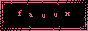

**[DONT TRUST THE GOVERNMENT](https://wikileaks.org/ciav7p1/?ref=thedissenter.org)**


```term
GPG Key Status : active
```
--------------------------------------------------------------------------

**~~~~~~~>>>** [](https://znkkw.github.io)


[](https://www.gentoo.org/) [](https://arf20.com/) [](https://letsdecentralize.org/) [](https://digdeeper.club/) 

[](https://www.librewolf/) [](https://www.cozynet.org/) [](https://fauux.neocities.org/) []() 

[](https://grapheneos.org/) []() [](https://github.com/torvalds/linux) [](https://www.openpgp.org/)

-------------------------------------------------------------------------
